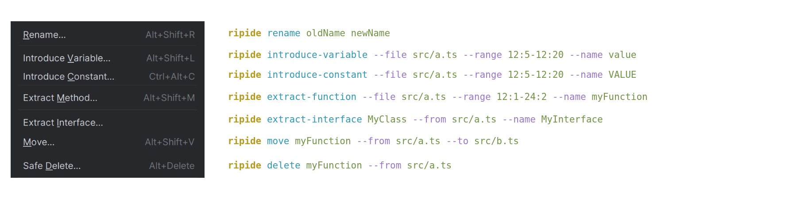

<div align="center">

<h1>
  <picture>
    <source media="(prefers-color-scheme: dark)" srcset="./branding/logo-dark.svg?v=ripide">
    
  </picture>
</h1>

[](https://npmjs.com/package/ripide)
[](https://npm.chart.dev/ripide)
[](https://github.com/harlan-zw/ripide/blob/main/LICENSE.md)
[](https://skilld.dev/gh/harlan-zw/ripide)

> Typesafe IDE-like refactoring for agents.

<p><sub>Made possible by my <a href="https://github.com/sponsors/harlan-zw">Sponsor Program 💖</a><br>
Follow me <a href="https://twitter.com/harlan_zw">@harlan_zw</a> 🐦 • Join <a href="https://discord.gg/275MBUBvgP">Discord</a> for help</sub></p>

</div>

## Why RipIDE?

When you rename a function in your IDE, it updates the references for you.
RipIDE aims to bring that same refactoring magic to your agent.

One command handles the references and edits.
Recorded source-slice tasks used fewer total tokens. Results depend on the task and model.



## Features

- ✂️ **IDE refactoring for your agent.** Rename functions, move files, and automatically update references across your project.
- 📉 **Measured mechanical tasks.** [Local source-slice tests](./bench/README.md) recorded token and time reductions for symbol and static class renames.
- 🪨 Built on [TypeScript 7.1 (dev)](https://github.com/microsoft/TypeScript), [Oxc](https://oxc.rs), [Ripgrep](https://github.com/BurntSushi/ripgrep), and [Volar](https://volarjs.dev).
- 🦎 Works with **Vue, Nuxt, React, and Solid**, plus plain TypeScript and JavaScript. Optional [Octane TSRX support](./packages/tsrx/README.md) covers authored-source scans and semantic renames.
- 🧰 **One command, many files.** Move exports, replace imports, delete unused declarations, or migrate CSS classes across your project.
- 🪂 **Preview first.** Dry runs show the diff; [type checking](#verify) blocks supported refactors that introduce errors.

## Installation

Requires Node 22.13+.

1. Install RipIDE:

   ```bash
   npm install -g ripide
   ```

2. Install the [RipIDE Agent Skill](./packages/cli/skills/ripast/SKILL.md) in your project with your preferred installer:

   With [skilld](https://skilld.dev/gh/harlan-zw/ripide):

   ```bash
   npx skilld add ripide
   ```

   Or with [skills.sh](https://skills.sh):

   ```bash
   npx skills add harlan-zw/ripide --skill ripast
   ```

3. Ask your coding agent:

   ```text
   Find better names for functions.
   ```

RipIDE uses ripgrep when available. You do not need to install it.
If ripgrep is missing, Git discovers tracked and untracked files in the working tree.
Searches read current file contents, including local edits. Git ignore rules exclude untracked files.
Globs filter candidate paths. Git does not apply `.ignore` or `.rgignore`, or exclude tracked files through ignore rules.
Run separately inside submodules and nested repositories when using the Git fallback.

If both tools are missing, or Git has no working tree, RipIDE searches files in Node.
This fallback can be slower. It supports fixed-string searches, file listing, globs, and standard ignore files.
Programmatic regex searches use ripgrep syntax when available, or Git extended regular expressions with the Git fallback.
Regex searches require ripgrep, or Git and a Git working tree.

### Cursor and Claude Code

Requires Node 22.13+, pnpm, and an agent with shell access.
Run from your project root:

```bash
npm install -g ripide
pnpm dlx skills add harlan-zw/ripide --skill ripast --agent cursor claude-code --yes
```

Then ask in Agent chat or Claude Code:

```text
/ripast Preview renaming useStore to useAppStore.
```

The CLI is named `ripide`. The Agent Skill is named `ripast`.
The installer adds the Skill and its references for both clients.
For manual installation, copy the whole [Skill directory](./packages/cli/skills/ripast), including `references/`:

| Client | Project directory |
| --- | --- |
| [Cursor](https://cursor.com/docs/skills) | `.cursor/skills/ripast/` |
| [Claude Code and its IDE extension](https://code.claude.com/docs/en/skills) | `.claude/skills/ripast/` |

RipIDE runs through the agent's shell. It includes no MCP server or MCP configuration.
Each CLI invocation uses its current working directory.
If you switch projects or monorepo packages, run from the intended root.

## Usage

Run commands from your project root. Commands preview changes by default; pass `--apply` to write.
Use `--profile full` to see the full diff in an agent environment.

### What can RipIDE do?

<details>
<summary><b>🔍 Find every usage of a symbol</b></summary>

Find matching identifiers, strings, properties, and JSX references.
The scan includes Vue template interpolations and directive expressions.

```bash
ripide scan useStore
ripide scan useStore --kind identifier-reference,import-specifier
ripide scan useStore --graph mermaid
```

`--graph mermaid|dot` draws relative import/export edges between hit files for quick triage.

</details>

<details>
<summary><b>✏️ Rename a symbol across the repo</b></summary>

Rename references using the native TypeScript 7 language server, including imports, JSX, types, and aliases.
Property keys change only when they refer to the same symbol.

```bash
# Preview the changes
ripide rename useStore useAppStore

# Write changes after type checking
ripide rename useStore useAppStore --apply

# Ambiguous declarations? Pick one or rename all
ripide rename useStore useAppStore --scope src/store.ts --apply
ripide rename useStore useAppStore --all --apply
```

Imports and references change together. The unrelated string keeps its spelling:

```diff
# src/store.ts
-export function useStore() { return 1 }
+export function useAppStore() { return 1 }
# src/consumer.ts
-import { useStore } from './store.js'
-export const value = useStore()
+import { useAppStore } from './store.js'
+export const value = useAppStore()
 export const label = 'useStore'
```

</details>

<details>
<summary><b>🔁 Replace an imported symbol with another export</b></summary>

Replace an imported binding with a project export, such as replacing `eventHandler(...)` with `defineAdminApiHandler(...)`.
RipIDE updates references and imports, then removes the old import.
It preserves the call arguments and function body.

New imports preserve the replaced relative import's extension policy.
For package imports, they follow relative imports in the consumer, then nearby project files.
Without a local policy, they use extensionless paths.
JavaScript paths keep emitted `.js`, `.mjs`, or `.cjs` endings for TypeScript targets.
Review mixed import policies in the dry run before applying.

```bash
ripide replace eventHandler defineAdminApiHandler
ripide replace eventHandler defineAdminApiHandler --apply

# Ambiguous target exports? Pick the declaring file
ripide replace eventHandler defineAdminApiHandler --target-scope layers/admin/server/utils/admin-api.ts --apply

# Route an existing binding through a named barrel and a framework alias
ripide replace getSiteConfig getSiteConfig --target-scope ../nuxt-site-config/src/runtime/server/index.ts --target-import '#site-config/server' --apply
```

`--target-scope` can select a named re-export barrel outside the consumer project.
`--target-import` sets its import path explicitly, including Nuxt aliases.
Value and type exports retain their import kind. Existing imports from that path merge safely.
Default discovery still selects direct declarations and keeps the relative import policy.

</details>

<details>
<summary><b>🏔️ Refactor Nuxt auto-imports</b></summary>

Run `nuxi prepare` first to generate Nuxt's type declarations.
RipIDE uses these files to resolve auto-imported composables, utilities, and components used in pages and other consumers.
If a move requires an explicit import in a Vue file without a script block, RipIDE refuses it.

```bash
# A composable used in pages with no explicit import
ripide rename useCounter useTally --tsconfig .nuxt/tsconfig.json --apply

# Moving out of utils/composables/components adds explicit imports to consumers
ripide move format --from utils/format.ts --to lib/format.ts --apply
```

</details>

<details>
<summary><b>📦 Move an exported declaration</b></summary>

Move a top-level export and update its imports.
RipIDE splits declarations such as `export const a = 1, b = 2` and preserves aliases.
It copies required imports and removes unused ones. If the symbol depends on a local, unexported helper, it refuses the move.

```bash
ripide move helper --from src/utils/a.ts --to src/utils/helpers.ts --apply
```

</details>

<details>
<summary><b>📁 Rename a file and update every import</b></summary>

Update import paths when moving or renaming a file.
The Vue adapter also updates component tags in PascalCase and kebab-case.

```bash
ripide rename-file src/utils.ts src/lib/helpers.ts --apply
```

</details>

<details>
<summary><b>🧹 Delete an unused declaration</b></summary>

Delete a top-level declaration after checking for references, then remove imports used only by that declaration.
If references remain, RipIDE prints their locations and refuses the deletion.
Omit `--apply` to preview the changes.

```bash
ripide delete helper --from src/utils.ts
ripide delete helper --from src/utils.ts --apply
```

</details>

<details>
<summary><b>🎨 Migrate Tailwind / CSS class tokens</b></summary>

Rename class tokens in string literals, Vue `class` and `:class` attributes, and CSS `@apply` directives.
RipIDE preserves variant prefixes (`hover:`, `dark:md:`), `!` important markers, and arbitrary values.

```bash
# Single pair
ripide css-class-rename bg-gray-500 bg-neutral-500 --apply

# Bulk design-token migration
ripide css-class-rename --map tokens.json --apply

# Seed the map by listing every class in the repo
ripide css-class-scan --json > tokens.raw.json

# Find barely used classes to clean up
ripide css-class-scan --sort count-asc

# Find files introducing the most unique class tokens
ripide css-class-scan --by file
```

</details>

<details>
<summary><b>🌳 Print a project declaration tree</b></summary>

List declarations by file. Use `--exports exported` for exports or `--exports local` for declarations without exports.

```bash
ripide tree --exports exported
ripide tree --exports local --glob '*.ts'
```

In agent environments (`std-env`'s `isAgent`), defaults to a compact architecture summary.

</details>

<details>
<summary><b>🔎 Find unreferenced top-level declarations</b></summary>

Report top-level declarations with no semantic project references.
Review each result before deleting it. External callers, frameworks, dynamic registries, and entrypoints may still use these declarations.

```bash
ripide unused
ripide unused --exports local
ripide unused --exports all --json
```

</details>

<details>
<summary><b>🤖 Drive from an AI agent</b></summary>

`--json` emits the same contract in terminals and detected agent environments.
The default JSON profile is compact. Use `--profile full` for complete source content.
Every response contains `_tag`, `command`, `base`, and `data`.
Mutation tags are `Preview`, `Applied`, `Refused`, or `Empty`. Discovery uses `Result`; failures use `Error`.
For mutating commands, compact JSON returns `[path, lines]` tuples inside `data` instead of full source files.
If line ranges shift, tuples include both ranges: `[path, beforeLines, afterLines]`.
Lines are one-based and inclusive. `"3,10-12"` identifies separate ranges; `"3+"` marks a gap after line 3.
File moves appear separately as `moves: [[from, to]]`.
The `_tag` identifies the outcome. The `data.verification` field reports checks. Empty warnings and regressions are omitted.
Verification entries use `[checker, scope, files, newErrors]`.
An optional fifth number counts errors excluded from the result.
Skipped checks return `"disabled"`, `"no-changes"`, or `"not-applicable"`.
After applying, earlier file reads are outdated. Read changed ranges only when you need current code.
If an editing tool requires a fresh read, follow that requirement.
Use `--profile full --json` for complete before/after content.
If verification finds new type errors, the command refuses `--apply` and exits with a non-zero status.

```bash
ripide rename useStore useAppStore --apply --profile agent --json
# {
#   "_tag": "Applied", "command": "rename", "base": "/project",
#   "data": {
#     "changes": [["src/store.ts", "12"], ["src/app.ts", "1,8"]],
#     "verification": [["typescript", "touched", 2, 0]]
#   }
# }
```

</details>

### Verify

`rename`, `replace`, `move`, `delete`, and `rename-file` enable verification by default.
They compare type errors before and after the change, then refuse `--apply` if new errors appear.
The receipt identifies the checker, scope, checked file count, and new error count.
Full JSON uses named check fields. Compact JSON uses the tuples shown above.
`typescript` uses TypeScript's native language server diagnostics. `vue` uses the Vue adapter's diagnostics.
These checks compare error diagnostics against proposed content before writing files.
They do not run `tsc --noEmit`, a build, or tests.
If the receipt covers your required scope, do not repeat that diagnostic check without another edit.
Replacement defaults to project checks. Other refactors default to touched files in both the CLI and SDK.
Use `--verify-mode project` for broader checks, including unchanged Vue consumers.
Project verification respects file discovery ignores. Refactor globs limit edits without narrowing project verification.
Use `--verify-mode none` to skip verification. The SDK accepts `verifyMode: 'none' | 'touched' | 'project'`.
The boolean SDK `verify` option and CLI `--verify` / `--no-verify` flags are removed.
CSS class renames do not run a typecheck.

### Profiles

`--profile auto|agent|full` controls output verbosity.
For text, `auto` uses `std-env`'s `isAgent` detection.
Agents get compact summaries; terminals get full diffs and trees. JSON `auto` always uses compact output.

### Output limits

Agent pages target 4 KiB, with at most 40 displayed results.
Some commands use smaller or larger result counts. Check their help for details.
Use `--page-bytes 8192` for a larger page. Follow `nextOffset`, since page sizes vary.
The target measures serialized page bytes. It does not estimate tokens.
Each result collection has its own target. Response metadata can add bytes.
A page retains at least one result, even when that result exceeds the target.
Agent stdout has a separate 32 KiB ceiling for large individual results and combined collections.
Full output has no default page target or byte ceiling. Both flags work with either profile.
The minimum byte limit is 1024.
Long project or artifact paths can require a larger limit to retain response metadata.
An insufficient metadata budget refuses the operation before writes. Its error response can exceed the rejected limit.

```bash
ripide tree --profile agent --limit 10
ripide tree --json --declarations --file src/store.ts --page-bytes 8192
```

Paging counts results. For `tree`, each result is a file unless `--declarations` is supplied.
Use `tree --declarations` to page declarations within large files.
The byte limit also protects against one oversized result.
Limits change display only. Discovery, verification, and applied changes remain complete.

If JSON exceeds the byte limit, `data.output._tag` is `Omitted`.
The response preserves `_tag`, `command`, and `base` and provides recovery instructions.
Text retains complete leading lines and reports omitted output.
Oversized graphs return an empty graph with an omission comment.
Stdout limits do not bound stderr logs.

Use `--json --artifact <new-file.json>` to save complete evidence outside model context.
The artifact path must be new. Artifacts have no display limit.
If output is incomplete, inspect that artifact with `ripide page`. Keep the original command outcome and verification receipt.
Paging saved evidence avoids another project scan. It never repeats a mutation.

### Read saved evidence

Run the operation once, then inspect its saved evidence:

```bash
ripide tree --json --artifact /tmp/ripide-tree.json
ripide page --input /tmp/ripide-tree.json
ripide page --input /tmp/ripide-tree.json --path /files/0/declarations
ripide page --input - --path /files/0/declarations < /tmp/ripide-tree.json
```

Read the page at `data.view`. Its saved evidence identity appears at `data.source.sha256`.
The root page lists scalar metadata and paths to nested collections and objects.
Object menus also page their children. Large values expose paths and byte counts in `data.view.omittedValues`.
If the selected value is an array, the command pages its items.
Select paths from that menu. Artifact shapes differ between commands; the root is not always an array.
Paths use JSON Pointer syntax. The empty path selects the root.
Escape `/` as `~1` and `~` as `~0` inside property names.
Each page is JSON; `--json` is unnecessary.
Use `--input -` for a single JSON document on stdin.

Pages default to 40 results, a 4 KiB page target, and a 32 KiB response ceiling.
Use `--limit`, `--offset`, `--page-bytes`, or `--max-bytes` to adjust them.
For arrays of objects, use `--fields name,line` to select row fields.
Long strings page into UTF-8 text parts with source line numbers. Offsets count parts.
For saved source, select a path such as `/changes/0/after` from the artifact menu.
Follow `data.view.nextOffset` to continue. If one item is too large, select its nested fields or raise the ceiling.

For several known requests, keep one evidence session:

```bash
ripide page --input /tmp/ripide-tree.json --session <<'NDJSON'
{"_tag":"Select","path":"/files/0/declarations"}
{"_tag":"Select","path":"/files/0/imports"}
{"_tag":"Close"}
NDJSON
```

The session loads the artifact once and keeps an immutable snapshot.
It writes an initial page, then one JSON response per NDJSON request.
Requests are `Next`, `Previous`, `Select`, and `Close`.
`Select` accepts a JSON Pointer `path` and an optional `offset`.
It resets page history and defaults to offset zero. `Previous` returns the prior visited page for that path.
If a page includes `nextOffset`, send `Next` to continue.
Failed navigation requests return `Error` without changing the current path or history. Correct the request, then continue.
Session navigation uses stdin, so `--session` requires a file input.
Use live navigation only when your shell tool keeps stdin open between requests.
Otherwise, batch known requests or use separate `ripide page` calls. These calls reread evidence without scanning the project.
The original mutation outcome remains authoritative. A page response only reports evidence inspection.
If you omitted the artifact during a mutation, do not apply again just to create evidence.

Reusable helpers are exported from `ripide/presentation`:
`selectOutput` accepts `pageBytes` and an optional page renderer to fit arbitrary result collections.
It returns `nextOffset` when another page exists.
`renderBoundedOutput` bounds arbitrary rendered values, and `createTextOutput` bounds cumulative text writes.

See [API contract migration](docs/api-contracts.md) for JSON consumers and SDK formatting imports.

## Commands

| Command | Purpose |
| --- | --- |
| `ripide scan <pattern>` | Classify every occurrence (identifier vs string vs property vs JSX). Optional `--graph mermaid\|dot`. |
| `ripide tree` | Print a project declaration tree, grouped by file. |
| `ripide unused` | Find unreferenced top-level declarations. |
| `ripide page --input <file.json>` | Page saved JSON evidence without repeating its operation. |
| `ripide rename <from> <to>` | Scope-aware symbol rename via the native TypeScript server. |
| `ripide replace <from> <to>` | Replace an imported symbol with another project export; rewrites imports and references. |
| `ripide move <symbol> --from <a> --to <b>` | Move a top-level export and rewrite every import site. |
| `ripide delete <symbol> --from <file>` | Delete an unused top-level declaration; refuses if references remain. |
| `ripide rename-file <old> <new>` | Rename a file and rewrite every import site (including `.vue` consumers). |
| `ripide css-class-rename <from> <to> \| --map <file.json>` | Rename tailwind/CSS utility class tokens repo-wide. |
| `ripide css-class-scan` | List class tokens; use `--sort count-asc` for rare tokens or `--by file` for files with the most unique classes. |

Run `ripide --help` for all commands, or `ripide <command> --help` for its options.

## Programmatic API

The SDK uses an isolated engine. Core supports TypeScript and JavaScript without framework dependencies.

```ts
import { createEngine } from 'ripide-api'

const engine = createEngine()
const hits = engine.scan('useStore', { cwd: process.cwd() })
const result = await engine.rename('useStore', 'useAppStore', { cwd: process.cwd() })
engine.commit(result)
```

Supply framework extensions explicitly:

```ts
import { createEngine } from 'ripide-api'
import { createVueExtension } from 'ripide-vue'

const engine = createEngine({ extensions: [createVueExtension()] })
const result = await engine.rename('useStore', 'useAppStore', { cwd: process.cwd() })
engine.commit(result)
```

The CLI loads relevant optional packages. The SDK never loads optional packages automatically.
Read the [extension contract and migration guide](./docs/engine.md) before adding a language.

Reuse declaration analysis during repeated SDK inspection:

```ts
import { buildDeclarationTree, createDeclarationCache } from 'ripide-api'

const cache = createDeclarationCache({ maxEntries: 1024, maxBytes: 16 * 1024 * 1024 })
const tree = buildDeclarationTree({ cwd: process.cwd(), cache })
const exported = buildDeclarationTree({ cwd: process.cwd(), cache, exports: 'exported' })
console.log(cache.stats())
cache.clear()
```

Each inspection discovers files again and checks their current content.
The cache retains declaration metadata, imports, and re-exports. It does not retain type or reference results.
It also works with `buildUnusedDeclarations`; only declaration analysis is cached.
Instances belong to the caller. Independent CLI processes do not share this cache.

## Limitations

**CSS custom properties.** CSS class migration handles class tokens and `@apply`.
It does not rename custom properties such as `--foo-a` in CSS, JavaScript, or Vue styles.
It does not report dynamic variable candidates such as `` `--foo-${bar}` ``.

**Scoping with `--glob`.** Pass comma-separated patterns. Prefix a pattern with `!` to exclude matching files:

```bash
ripide tree --exports exported --glob '*.ts,*.vue,!.nuxt/**,!**/*.d.ts,!**/dist/**'
```

**Nuxt projects.** Point `--tsconfig` at the generated config so path aliases and layer references resolve correctly:

```bash
# After `nuxi prepare`
ripide rename useFoo useBar --tsconfig .nuxt/tsconfig.json --apply
ripide tree --exports exported --glob '*.ts,*.vue,!.nuxt/**'
```

`ripide components` reads `.nuxt/components.d.ts` when available. Without it, the command discovers components from file paths.

**Encoding.** RipIDE assumes UTF-8 + LF. CRLF and BOM files are untested; convert with `dos2unix` / strip BOM before running mutating commands.

## Credits

- [TypeScript 7](https://github.com/microsoft/TypeScript): native language server behind rename, references, file renames, and verification.
- [Volar](https://github.com/volarjs/volar.js) + [@vue/language-tools](https://github.com/vuejs/language-tools): cross-`.vue` rename and diagnostics.
- [oxc](https://github.com/oxc-project/oxc): fast parser for template-expression classification.
- [Ripgrep](https://github.com/BurntSushi/ripgrep): finds candidate files before parsing, with Git and Node fallbacks.

## License

Licensed under the [MIT license](https://github.com/harlan-zw/ripide/blob/main/LICENSE.md).

## Agent benchmarks

Forty runs compared RipIDE with ordinary editing on ten matched source-slice tasks using both models.
Five tasks renamed TypeScript symbols. Five migrated static Vue class tokens.
RipIDE passed **20/20** runs. Ordinary editing passed **19/20**.

| Model | Completed pairs | Fewer total tokens | Less total time |
| --- | --- | --- | --- |
| GPT-6 Luna, medium | 9 | 60.4% | 15.4% |
| GLM 5.3 Flash | 10 | 73.9% | 55.4% |

Percentages compare completed pairs within each model. One run per combination used source slices, with fixed method order per model.
Total tokens include cached input once. Installation, Skill loading, generated state, and full builds were excluded.
These observations do not establish architecture gains or dollar savings.
See [full results, methods, and limits](./bench/README.md) and the [recovery protocol](./evals/experiment/README.md).
