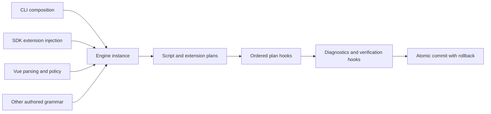

# Engine extensions

Create an engine with the extensions the project requires.
Core loads no optional packages and has no extension registry.
The CLI detects Vue source and Nuxt configuration before loading `@ripast/vue`.

```ts
import { createEngine } from '@ripast/core'
import vue from '@ripast/vue'

const engine = createEngine({ extensions: [vue] })
const result = await engine.runRename('before', 'after', { cwd: '/project' })
engine.apply(result)
```

## Migration

Replace SDK calls that relied on automatic Vue loading with calls on an injected engine.
Import template wrap and unwrap operations from `@ripast/vue`.
Remove SDK `vue` flags. Create an engine without the extension for a script-only project.
The CLI keeps its Vue flag at the composition boundary.

## Contract

An extension supplies its name and suffixes.
Its synchronous parser returns an AST, script text, and authored source offsets.
For custom grammar, return an AST whose positions already refer to authored source and set `scriptStart` to zero.
For a contiguous script block, return block-local positions and the block's authored `scriptStart`.
Parsing requires no semantic service.

Declare supported mutations through `operations`.
Semantic methods contribute rename, import rewrite, file rename, inspection, and diagnostic plans.
Implicit binding scopes, generated paths, project configuration, and class parsing belong to the extension.
Suffix ownership cannot overlap. Semantic service ownership cannot repeat.
Setup runs synchronously. Broken setup stops engine creation.

## Lifecycle

`setup(hooks)` receives an instance-owned, typed Hookable instance.
`operation:plan` runs in extension injection order after the script and semantic plans.
Hooks append authored `FileChange` entries. Duplicate paths currently refuse, including identical duplicate plans.
Semantic method composition deduplicates identical plans and refuses conflicting plans.
A hook must preserve the source bytes in `before`.

If a hook adds changes, the engine checks script diagnostics again.
It then checks changed extension source through `regressions` or requires `verifyPlan`.
`operation:verify` runs last, in injection order, when verification is enabled.
Verification hooks append failures to `regressions` or throw a refusal.
`engine.apply(result)` rejects diagnostic regressions before writing.
File relocation and source edits share the core commit boundary with rollback.
Dry runs only return plans.

## Limits

An extension controls the accuracy of its AST and semantic plans.
Extension hooks must not write files. They receive no commit callback.
Core refuses unknown suffixes during mutations because they may contain consumers.
Known asset suffixes do not require extensions.
Vue replacement refuses direct Vue consumers; script replacement still verifies unchanged Vue consumers.
Runtime hooks execute sequentially. Core promises no zero-overhead extension path.


