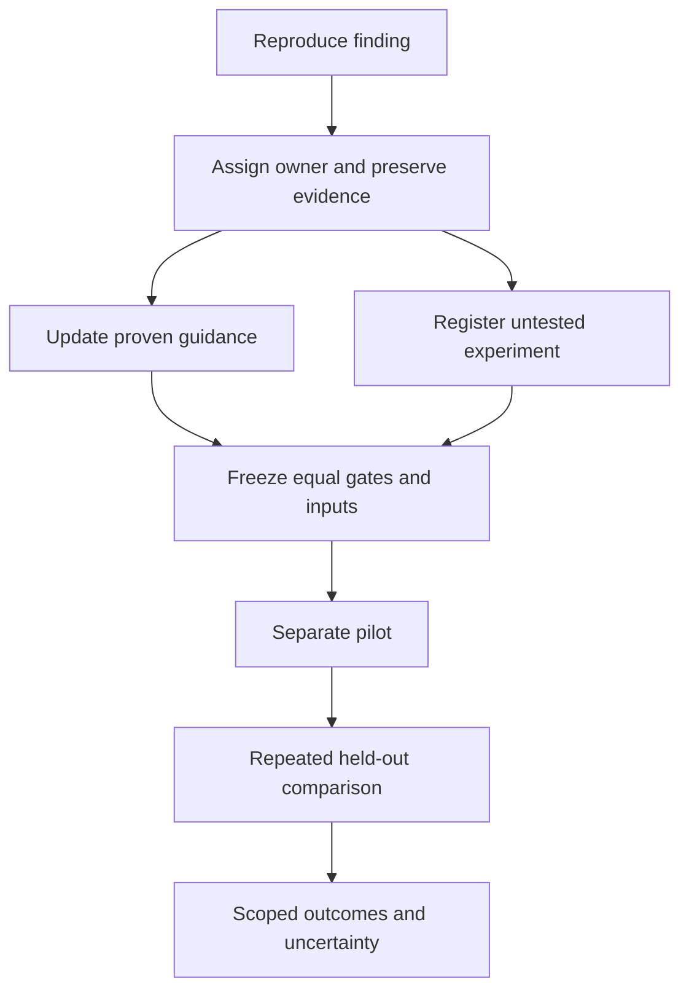

# Benchmark runbook

Compare equal behavior with frozen inputs, defined metrics, and repeated runs.
Keep complete evidence outside model context. Show the evidence needed for the next decision.

## Architecture work

Design new contracts with direct edits. Use supported semantic commands for mechanical steps.
If the target and operation are known, skip redundant listings and scans.
If a move crosses packages, inspect destination dependencies, imports, and exported entry points first.
Update dependencies only when their graph changes.
If public types or exports change, build affected declarations before downstream typechecks.
Keep verification enabled. Repair genuine dependency failures.

Search to answer one uncertainty that can change the next step.
Broaden only when the result exposes another uncertainty.
Batch independent reads. Keep dependent mutations and checks sequential.

## Output and evidence

| Operation | Model-facing evidence | Complete artifact |
| --- | --- | --- |
| Search | Relevant locations, short context, total and omitted counts | Arguments and all matches |
| Inspection | Requested subtree, signatures, names, and relationships | Complete source or graph |
| Preview | Changed paths, narrow diff, verification receipts, and diagnostics | Complete plan and source |
| Apply | Actual exit, applied or refused mode, scope, and changed paths | Raw streams and byte changes |
| Successful check | Name, exit, duration, and summary | Complete streams |
| Failed check | Cause, relevant locations, diagnostic counts, and artifact path | All diagnostics and streams |
| Tool discovery | Needed capability and resolved artifact | Catalog, manifests, and hashes |
| Benchmark report | Endpoint, defined resource totals, quality, and uncertainty | Samples, usage, and provenance |

Keep relevant names and paths. Count-only inventories can force extra calls.
Disclose omissions and provide focused retrieval.
Put actionable errors before bulk payloads.
Never silently drop diagnostics to meet an output budget.
Artifact bytes are not model input bytes or tokens.

Agent mutation JSON provides changed-line tuples and diagnostic receipts.
Use `--profile full --json` when complete before/after source is required.
Read changed code on demand. Follow editing-tool requirements for fresh reads.

If JSON is malformed, record that fact and preserve the raw bytes.
Recover complete errors before classifying an apparent false positive.
Never disable verification to compensate for incomplete output.

Resolve the installed package's JavaScript `bin` target when invoking it through Node.
An executable shell shim is not a JavaScript module.
Record both the outer launcher and actual executed artifact, including versions and hashes.

## Checks and publication

Keep meaningful failing-first tests.
After a failure, repair the cause and run the focused proving check.
If source and inputs are unchanged, do not repeat a failing lint command.
If a diagnostic receipt covers the required scope, do not repeat that check without a relevant edit.
Run required builds and tests outside that receipt.
Run final required checks on the submitted tree.

A compound command's final exit does not prove every child succeeded.
Preserve child exits separately. Do not classify every failed check as wasted work.

If publication needs a schema, validate the final document once before rendering or submission.
Repeat validation only after changes or a failure.
Keep publication work separate from implementation measurements.

## Before scoring

Freeze these inputs before dispatch:

- Readable task, treatment, supplied context, and steering text.
- Source commits, dependency lockfiles, tool artifacts, and hashes.
- Model, reasoning effort, runtime, Skill, and runbook revisions.
- Shared capability scope and independent safety gates.
- Cache conditions, method order, load policy, deadlines, and retry budgets.
- Token categories, phase endpoints, failure treatment, and aggregate weights.
- Pilot, repeat count, task selection, and held-out scored tasks.

Use an external recorder. Do not add arm-specific logging during scored work.
Keep private transcripts, credentials, and raw context outside public result artifacts.
Preserve stdout, stderr, child exits, starts, completions, and artifact locations separately.
Keep failed setup, refused operations, retries, and corrected measurements.

Run the same safety and capability gates in every arm.
Include unrelated names, aliases, mixed consumers, source changes, unsupported formats, and rollback behavior.
If a capability is unavailable, disclose it. Do not treat an unavailable gate as passing.

Separate mechanical, mixed, and architecture cohorts.
Pilot direct edits, forced tool use, and hybrid choice separately.
Select repeat counts before scoring. Counterbalance method order and cache conditions.
Run serially or on demonstrably isolated resources.
Use installed projects for full-project claims.
Keep first-use setup separate from prepared-use measurements.

## Accounting and claims

Count usage once per response identifier. Do not sum cumulative usage events.
Report input, cached input, uncached input, output, reasoning subsets, and total tokens together.
Count cached input and reasoning as subsets when the provider includes them within input or output.
Separate arm, controller, implementation, publication, and integration resources.
Preserve precise UTC timestamps and overlapping phase spans.
Record the commit-request response and completed tool return. Do not silently change endpoints after scoring.

Report all attempts, completion rates, repair costs, task medians, and summed resources.
Report uncertainty from repetitions. A single pair does not establish a causal effect.
Report dollars only from recorded provider charges.
State quality differences before cost comparisons.
Scope claims to the operations, project state, setup, and metrics actually measured.

## New findings

Record the source, time, hash, proving command, observed behavior, and limits.
Assign a codebase, Skill, runbook, harness, or reporting owner.
Record impact, effort, confidence, dependencies, and a falsifying experiment.
Update proven procedure rules. Keep unmeasured savings separate.

Package usage: [RipIDE Skill](../packages/cli/skills/ripast/SKILL.md).
Existing measurements: [evaluation documentation](../evals/README.md).
