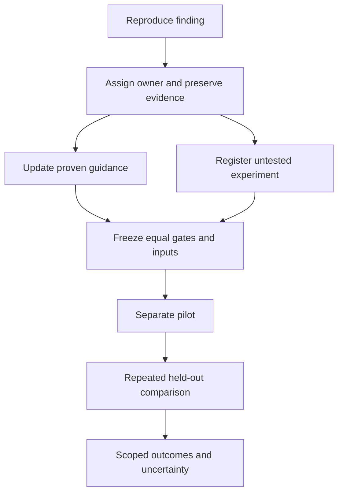

# Benchmark runbook

Compare equal behavior with frozen inputs, defined metrics, and repeated runs.
Keep complete evidence outside model context. Show the evidence needed for the next decision.

## Architecture work

Design new contracts with direct edits. Use supported semantic commands for mechanical steps.
If the target and operation are known, skip redundant listings and scans.
If a move crosses packages, inspect destination dependencies, imports, and exported entry points first.
Update dependencies only when their graph changes.
If public types or exports change, build affected declarations before downstream typechecks.
Keep verification enabled. Repair genuine dependency failures.

Search to answer one uncertainty that can change the next step.
Broaden only when the result exposes another uncertainty.
Batch independent reads. Keep dependent mutations and checks sequential.

## Output and evidence

| Operation | Model-facing evidence | Complete artifact |
| --- | --- | --- |
| Search | Relevant locations, short context, total and omitted counts | Arguments and all matches |
| Inspection | Requested subtree, signatures, names, and relationships | Complete source or graph |
| Preview | Changed paths, narrow diff, verification receipts, and diagnostics | Complete plan and source |
| Apply | Actual exit, outcome tag, scope, and changed paths | Raw streams and byte changes |
| Successful check | Name, exit, duration, and summary | Complete streams |
| Failed check | Cause, relevant locations, diagnostic counts, and artifact path | All diagnostics and streams |
| Tool discovery | Needed capability and resolved artifact | Catalog, manifests, and hashes |
| Benchmark report | Endpoint, defined resource totals, quality, and uncertainty | Samples, usage, and provenance |

Keep relevant names and paths. Count-only inventories can force extra calls.
Disclose omissions and provide focused retrieval.
Put actionable errors before bulk payloads.
Never silently drop diagnostics to meet an output budget.
Artifact bytes are not model input bytes or tokens.

Compact mutation JSON provides changed-line tuples and diagnostic receipts inside `data`.
Read `_tag` for the outcome. Every response also identifies `command` and `base`.
JSON defaults are independent of agent detection. Keep explicit profiles equal across comparison arms.
Use `--profile full --json` when complete before/after source is required.
Record the verification mode and operation defaults. Use only `--verify-mode none|touched|project`.
SDK callers use `verifyMode`. Preserve rejected legacy option attempts in raw evidence.
Read changed code on demand. Follow editing-tool requirements for fresh reads.

If JSON is malformed, record that fact and preserve the raw bytes.
Recover complete errors before classifying an apparent false positive.
Never disable verification to compensate for incomplete output.

Resolve the installed package's JavaScript `bin` target when invoking it through Node.
An executable shell shim is not a JavaScript module.
Record both the outer launcher and actual executed artifact, including versions and hashes.

## Coordinator handoffs

Give each preparation agent a fresh task brief instead of a full transcript fork.
Include the decision, owned paths, source commit, constraints, required checks, and private evidence references.
Carry forward relevant corrections and unresolved failures. Do not copy unrelated attempts or historical tool streams.
Keep evaluator answers outside candidate briefs, as required by Runner preflight.

Set handoff budgets before delegation. Use 4 KiB per brief and 8 KiB per returned receipt by default.
Measure UTF-8 bytes. These limits control context transfer, not provider token accounting or evidence retention.
If required facts exceed a budget, split the task or provide an indexed artifact with focused retrieval.
Never truncate a failure or omit an unresolved decision to fit the limit.

Return at most three outcome bullets, followed by a structured evidence receipt.
Use this TypeScript shape for preparation handoffs. It documents the contract; the harness does not enforce it.

```ts
interface Artifact {
  path: string
  sha256: string
}

type Outcome
  = | { _tag: 'Passed', exit: 0 }
    | { _tag: 'Failed', exit: number | null, cause: string }
    | { _tag: 'Unavailable', reason: string }

interface EvidenceReceipt {
  task: string
  sourceCommit: string
  submittedCommit: string | null
  changedPaths: string[]
  checks: {
    command: string[]
    cwd: string
    scope: string[]
    startedAt: string
    completedAt: string | null
    outcome: Outcome
    evidence: Artifact
  }[]
  diagnostics: {
    total: number | null
    shown: { path: string | null, message: string }[]
    omitted: number | null
    evidence: Artifact
  }
  limits: string[]
  manifest: Artifact
}
```

Use UTC timestamps. Record each executed child command separately.
Use `Failed` for nonzero exits, signals, and timeouts. Explain null exits and incomplete timestamps in `limits`.
Use `Unavailable` when execution evidence is missing. Never infer a passing check from a summary or command string.
Record unknown diagnostic counts as null, with the reason in `limits`.
The manifest indexes complete streams, failures, source hashes, session identifiers, and artifact provenance.
Keep it and referenced raw artifacts in a private scratch directory, with directory mode `700` and file mode `600`.
Keep credentials out of manifests. Verify artifact hashes before using a receipt to make a decision.
If evidence is missing or stale, request the exact artifact or rerun the affected check.

Before deep reads, inspect keys and select the fields needed for the pending decision.
For example, inspect `jq 'keys' receipt.json`, then project check outcomes, changed paths, diagnostics, and limits.
Select records before projecting fields. For Worktrunk, select the task branch before returning its worktree path:

```sh
wt list --format=json | jq '.items[] | select(.branch == "TASK_BRANCH") | .worktree.path'
```

Count entries and omitted diagnostics. Keep failure causes and evidence references in every outcome projection.
Open complete failure evidence before deciding whether a defect is resolved or a check is redundant.
Retrieve named records or line ranges from complete artifacts. Save the selection and its source hash.
Avoid dumping a full worktree inventory, catalog, registration, or transcript into coordinator context.

Freeze the handoff contract with the runbook revision before a new comparison.
Keep historical session and token inventories separate from predicted benefits.
Distinguish active phase sessions from historical sessions referenced only as evidence.
A smaller handoff does not establish better completion, lower total usage, or faster execution.
Measure those outcomes in a registered comparison with equal acceptance gates and retained failures.

## Checks and publication

Keep meaningful failing-first tests.
After a failure, repair the cause and run the focused proving check.
If source and inputs are unchanged, do not repeat a failing lint command.
If a diagnostic receipt covers the required scope, do not repeat that check without a relevant edit.
Run required builds and tests outside that receipt.
Finish builds before checks that read generated exports.
Keep generated artifacts unchanged until those checks finish.
Run final required checks on the submitted tree.

A compound command's final exit does not prove every child succeeded.
Preserve child exits separately. Do not classify every failed check as wasted work.

If publication needs a schema, validate the final document once before rendering or submission.
Repeat validation only after changes or a failure.
Keep publication work separate from implementation measurements.

## Runner preflight

Inspect the effective native prompt without a model call.
Configuration flags alone may retain global instructions or Skills.
Apply the same personal-context isolation boundary to every arm. Preserve authentication.
Read-only mounts still allow reading. Restrict candidate visibility to an explicit resource list.
Expose its project, public runtime checks, and selected treatment resources.
Keep full reference solutions and answer maps outside that list. Run semantic acceptance in the controller after candidate completion.
Hide other attempts, preparation reports, notes, and historical native sessions.
Mount only the current attempt's native record directory at the runner's normal session path.
Keep authentication available without changing the runner's home or exposing credential bytes in receipts.
Before registration, prove denied and allowed reads inside each exact candidate namespace without model calls.
Include reference sources, answer maps, previous answers, and historical native sessions in the denied-read probes.
Prove public checks execute and current native records persist. Preserve failed probes and mount corrections.
Record readable answer artifacts in earlier runs as availability evidence. Do not infer that a model used them.
Record the effective configuration, prompt, mount rules, and treatment Skill hashes.
Supply the complete linked Skill resource tree and its source base path to the runner.
Pin each resource's hash. Resolve every relative link from that base during no-model preflight.
If only entry text is supplied, describe the treatment as an inline entry Skill.
Do not describe that treatment as a complete installed Skill.
If the entry is inline, state that it is already loaded. Do not request another entry read.
Keep exact instruction bytes separate from resource metadata. Copy local references inside the allowed project scope.
Missing references, escaping paths, and symlinks must stop preparation before model dispatch.
Before registration, verify which native transcripts, response identifiers, and usage records the runner persists.
Export available records. Preserve exact session identifiers and artifact hashes.
Mark unavailable native or provider internals explicitly. Ephemeral sessions may not persist native records.
If full native auditing is required, select the persistence and isolation mode before registration.
Smoke-test record persistence without model scoring.
Raw CLI event streams do not expose hidden reasoning or complete provider records.
Keep shared task constraints explicit after isolating personal instructions.
Require TypeScript for new scripts. Ordinary shell tools remain allowed.
State whether temporary edit helpers are permitted.
Record whether the fixture is a Git checkout. Supply that fact equally to every arm before dispatch.
Prove each advertised project capability inside the exact child environment before registration.
Shell and PTY success do not prove an initialized Git baseline.
If the prompt promises Git status or diffs, require a recorded `HEAD` and a clean authored baseline.
Select a Git source or declare explicit task setup for that baseline.
For explicit setup, prepare dependencies and supplied Skill resources before the initial commit.
Track every authored file. Exclude declared generated directories, dependencies, and supplied Skill copies equally.
Use `.git/info/exclude` for controller exclusions. Do not add an undeclared authored `.gitignore`.
Prove an authored edit appears in `git status` and `git diff`, then restore the baseline.
Before each dispatch, check `HEAD`, authored tracking, and clean status. Missing capability receipts must stop setup.
Generic `Files` fixtures require Git only when their registered task or prompt advertises it.
Supply identical fixture facts and required check coverage to every arm.
If required checks cover the whole fixture, scope additional post-apply review to changed hunks.
For optional `rg` searches, exit 1 means no matches. Propagate exit 2 or higher as infrastructure failure.
Record duplicate entry reads, decision-changing reads, diff output, and completed required stages separately from acceptance.
Before registration, freeze or suppress shared runtime warnings equally across arms.
These rules guide future registrations. They do not establish a measured gain or change frozen scores.

Before each model dispatch, run a shell and PTY smoke check inside the exact child environment.
Preserve its arguments, start, completion, streams, and exit.
If preflight fails, stop dispatch. Classify the failure as setup failure, rather than treatment quality.
Keep consumed usage and failed setup costs in study totals.
If runner isolation changes, freeze a new registration. Preserve the previous registration and every attempt.

Keep heavy builds, tests, and package installs outside scored attempts.
Worktree setup hooks can install packages automatically. Finish those hooks before scoring.
Record overlapping host operations and timestamps. Mark missing timing detail as unavailable.
During scored work, limit observer audits to saved receipts, streams, and lightweight filesystem checks.
Run optional compiler replays after the last arm exits.
Record observer command starts, completions, and resources separately from arm and controller measurements.
Report overlap without estimating a timing correction.

## Before scoring

Freeze these inputs before dispatch:

- Readable task, treatment, supplied context, and steering text.
- Source commits, dependency lockfiles, tool artifacts, and hashes.
- Model, reasoning effort, runtime, Skill, and runbook revisions.
- Shared capability scope and independent safety gates.
- Cache conditions, method order, load policy, deadlines, and retry budgets.
- Token categories, phase endpoints, failure treatment, and aggregate weights.
- Pilot, repeat count, task selection, and held-out scored tasks.

Preregister pass, fail, unavailable, and infrastructure outcomes, plus the gate order and acceptance rules.
Fix per-attempt deadlines, total attempt budget, retry and repair limits, and stop conditions.
State how failures, timeouts, missing usage, and repairs enter quality and resource totals.
Freeze cache assumptions, aggregation, and the rules for including complete pairs in comparisons.
Use the existing [recording boundaries](../evals/experiment/README.md#recording-boundaries) and [accounting definitions](#accounting-and-claims).
Record start and terminal times for gates, including failures and infrastructure errors.
If timing evidence is unavailable, preserve the failure and explain the missing boundary.
Report every attempt's status and resources in a table.
List excluded pairs and reasons; retain their resources in totals.
Define time speedup as `direct / hybrid` and resource reduction as `1 - hybrid / direct`.
Label each ratio's metric and endpoint. Mark zero or unavailable denominators unavailable.

Use an external recorder. Do not add arm-specific logging during scored work.
Keep private transcripts, credentials, and raw context outside public result artifacts.
Preserve stdout, stderr, child exits, starts, completions, and artifact locations separately.
Keep failed setup, refused operations, retries, and corrected measurements.

Run the same safety and capability gates in every arm.
Include unrelated names, aliases, mixed consumers, source changes, unsupported formats, and rollback behavior.
If a capability is unavailable, disclose it. Do not treat an unavailable gate as passing.

Separate mechanical, mixed, and architecture cohorts.
Pilot direct edits, forced tool use, and hybrid choice separately.
Fix repeat counts before held-out registration. Record the sample-size rationale and limits of inference.
Counterbalance method order within each task. Global alternation can leave one task always using the same first method.
For repeated two-method comparisons, give every task both direct-first and hybrid-first pairs.
Freeze the complete schedule and inspect first-method counts per task before dispatch.
Odd repeat counts cannot provide exactly equal order counts. Disclose that imbalance.
Record whether cache conditions are controlled or observed.
Run serially or on demonstrably isolated resources.
Use installed projects for full-project claims.
Keep first-use setup separate from prepared-use measurements.

A three-task, three-repeat comparison between two methods plans eighteen attempts. Label it a pilot.
That budget does not establish broad framework or product performance, even with fresh task text.
Previously seen operation classes and scaffold families limit the claim scope.
Keep the [held-out protocol](../evals/experiment/README.md#register-a-held-out-study) unchanged, including repeats divisible by six.
Do not increase the model budget to meet that protocol without authorization.

Freeze task acceptance independently of treatment output.
List allowed generated directories in both the common prompt and grader.
Keep authored files, pinned dependencies, configuration, and lockfiles outside that exemption.
Permitted scratch files must not become production imports or hide changed dependency bytes.
Run every registered runtime check before the final semantic and preservation graders.
This order catches check-generated changes to preserved source, assets, or dependencies.

Observe cache and host-load conditions. Local cache settings do not prove provider cache state.
Keep mixed utility tasks separate from broad architecture claims.
Do not revise tasks, acceptance gates, or endpoints after inspecting relative arm results.

The [engine fingerprint gate change](https://github.com/harlan-zw/ripide/pull/96) checks unchanged commits and changed-plan refusal.
Use the gate matching the frozen SDK. Require actual refusal and unchanged source bytes.
Before model dispatch, resolve each product gate's actual SDK entry point.
Compare its path and SHA-256 with the selected product metadata.
If they differ, stop preparation before any model call.
Save the resolved entry point and hash with the gate proof.
That proof does not establish freshness of appended consumers, configuration, or dependencies.
Register separate independent gates before making those stronger claims.

## Accounting and claims

Count command mentions, attempted stages, executed stages, and successful stages separately.
Use execution records and child exits. A command string does not prove execution.
If an earlier `&&` stage fails, later stages do not run.
Mark stages without execution evidence as `Unavailable`.

Count usage once per response identifier. Do not sum cumulative usage events.
Report input, cached input, uncached input, output, reasoning subsets, and total tokens together.
Count cached input and reasoning as subsets when the provider includes them within input or output.
Separate arm, controller, implementation, publication, and integration resources.
Separate child-agent usage from coordinator usage. Preserve unobserved categories as unavailable.
Arm usage imports replace that attempt's stdout accounting. Do not add both sources together.
Keep response identifiers unique across imported phase files and attempt owners.
Preserve precise UTC timestamps and overlapping phase spans.
Record the commit-request response and completed tool return. Do not silently change endpoints after scoring.

Report all attempts, completion rates, repair costs, task medians, and summed resources.
Retain setup failures, timeouts, refusals, failed delivery, repairs, and interrupted dispatches.
If usage is missing, mark it unavailable. Do not infer zero provider work.
Report setup and prepared-use costs separately. Show successful medians alongside all-workflow medians.
Report uncertainty from repetitions. A single pair does not establish a causal effect.
Report dollars only from recorded provider charges.
Without actual charge receipts, report charges as unavailable. A zero placeholder cannot establish free usage.
State quality differences before cost comparisons.
Scope claims to the operations, project state, setup, and metrics actually measured.

## New findings

Record the source, time, hash, proving command, observed behavior, and limits.
Assign a codebase, Skill, runbook, harness, or reporting owner.
Record impact, effort, confidence, dependencies, and a falsifying experiment.
Update proven procedure rules. Keep unmeasured savings separate.



Package usage: [RipIDE Skill](../packages/cli/skills/ripast/SKILL.md).
Existing measurements: [evaluation documentation](../evals/README.md).
