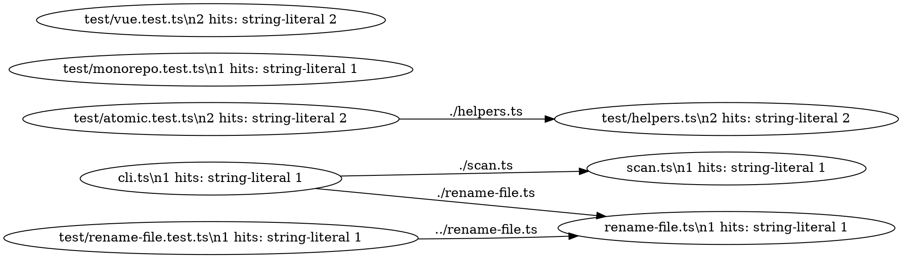

# ripast graph scan: DOT

Command:

```bash
cd harlan-claude-code/skills/ripast/bin
node --experimental-strip-types --no-warnings ./cli.ts scan ripast --graph dot --glob '*.ts'
```

Output:


```dot
digraph ripast_scan {
  rankdir=LR;
  "cli.ts" [label="cli.ts\\n1 hits: string-literal 1"];
  "rename-file.ts" [label="rename-file.ts\\n1 hits: string-literal 1"];
  "scan.ts" [label="scan.ts\\n1 hits: string-literal 1"];
  "test/atomic.test.ts" [label="test/atomic.test.ts\\n2 hits: string-literal 2"];
  "test/helpers.ts" [label="test/helpers.ts\\n2 hits: string-literal 2"];
  "test/monorepo.test.ts" [label="test/monorepo.test.ts\\n1 hits: string-literal 1"];
  "test/rename-file.test.ts" [label="test/rename-file.test.ts\\n1 hits: string-literal 1"];
  "test/vue.test.ts" [label="test/vue.test.ts\\n2 hits: string-literal 2"];
  "cli.ts" -> "rename-file.ts" [label="./rename-file.ts"];
  "cli.ts" -> "scan.ts" [label="./scan.ts"];
  "test/atomic.test.ts" -> "test/helpers.ts" [label="./helpers.ts"];
  "test/rename-file.test.ts" -> "rename-file.ts" [label="../rename-file.ts"];
}
```
