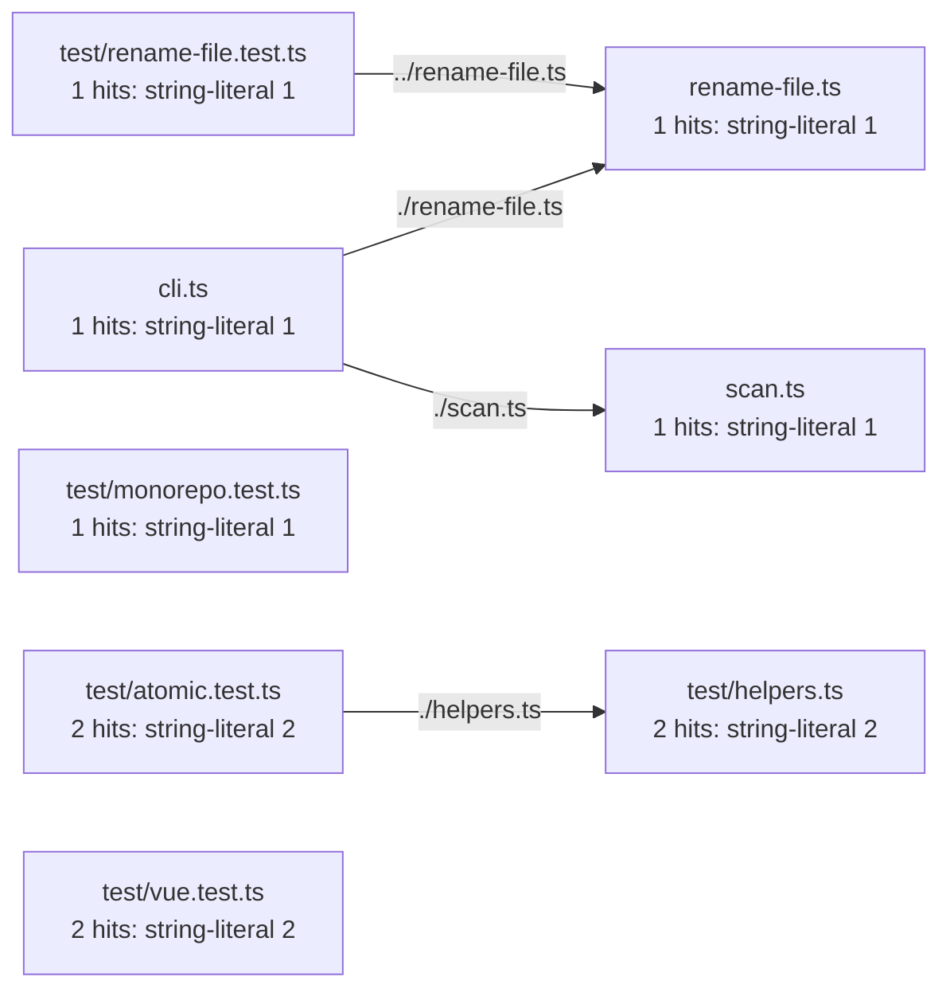

# ripast graph scan: Mermaid

Command:

```bash
cd harlan-claude-code/skills/ripast/bin
node --experimental-strip-types --no-warnings ./cli.ts scan ripast --graph mermaid --glob '*.ts'
```

Output:


