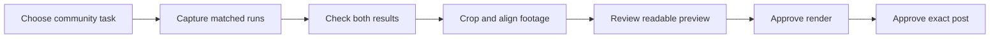

# Refactor comparison videos

Show the same task side by side. Use large code and one shared clock.
Show the result immediately. Keep each community's example specific.

## Community versions

| Destination | Task | Opening | Main proof |
| --- | --- | --- | --- |
| Twitter | TypeScript symbol rename | Same rename. Fewer agent steps. | Imports, references, elapsed time, and total tokens |
| Vue Reddit | Vue component file rename | Rename the component. Update its imports and template tags. | PascalCase and kebab-case tags, plus unchanged unrelated text |

Start with the TypeScript version. Generate a separate Vue version from a measured component rename.
Use the same visual structure. Replace the task, source files, measurements, and post text.

## Evidence before editing

1. Choose a narrow, useful task with at least two affected files.
2. Record the source commit, Ripast version, Skill revision, runner, model, and reasoning setting.
3. Give both methods identical source and the same task.
4. Give only the Ripast method its Skill. Record this difference.
5. Run each method once per source copy. Retain failures and raw output.
6. Check expected edits, unrelated content, and type diagnostics independently.
7. Record elapsed time and total tokens. Keep cached input visible in the method notes.
8. Compare a pair only if both methods complete the task and requested checks.

Use multiple repeated pairs before presenting a result as a stable expectation.
One run can demonstrate what happened in that run.

Store raw captures, transcripts, and temporary projects under `~/scratch/`.
Keep the production brief and evidence manifest beside each capture.
Include paths, hashes, units, timing boundaries, and any excluded setup in the manifest.



## First version: TypeScript for Twitter

Use the recorded C12 rename: `loadDotenv` to `loadProjectDotenv`.
The declaring file is `src/dotenv.ts`. The re-export is in `src/index.ts`.

The [9 October evidence](../evals/results/2026-10-09.json) records these results:

| Method | Elapsed time | Total tokens | Result |
| --- | --- | --- | --- |
| Codex with ordinary editing tools | 48.1900 s | 74,264 | Passed |
| Codex with Ripast | 8.3327 s | 30,284 | Passed |

Both used GPT-6 Luna with medium reasoning.
The measured task used this Ripast operation, followed by the independent source check:

```sh
ripast rename loadDotenv loadProjectDotenv --scope src/dotenv.ts --apply --profile agent
```

Use these figures only for the C12 example.
The broader Codex figures are 59.9% fewer total tokens and 60.5% less time across four completed pairs.
Keep the example result and aggregate result separate on screen.

The two batches contain 16 tasks and 14 completed pairs.
Their runner groups have different models and project assignments. Keep each group's percentages separate.

The retained JSON proves totals and checks. It is not screen-recording footage.
If reconstructing a view from transcripts, label it `Illustrated replay from recorded results`.
Do not invent per-command durations, token growth, cursors, or thinking text.

For a fresh capture, record the actual agent UI and retain the full uncut recording.
If the agent UI has no reliable token display, show the final total after completion.

## Camera and layout

- Export a 1920 × 1080 landscape composition at 30 fps.
- Start with the task and both code panes already visible.
- Put ordinary editing on the left and Ripast on the right.
- Label both panes. Use the same font size and crop scale.
- Crop to the command, changed code, and check result.
- Hide sidebars, tabs, unrelated output, and editor chrome.
- Use code at 32 px or larger in the 1080p composition.
- Use labels at 36 px or larger. Keep method notes readable.
- Use Ripast's [existing palette](../branding/README.md).
- Use one shared start and the same playback speed for both recordings.
- Keep the Ripast result visible while the other method finishes.
- Show elapsed time explicitly. Do not imply playback time equals execution time after speeding footage up.

Prefer a fixed, tight crop. Add a small zoom only if it makes the changed identifier easier to read.
Use silence by default. The video must make sense without audio.

## Cut structure

Target 12 to 18 seconds for the Twitter version.
Choose one compression factor for the entire paired recording.

| Beat | Screen content | Purpose |
| --- | --- | --- |
| First frame | Task, two panes, method labels | Explain the comparison before the viewer scrolls |
| Comparison | Commands and edits, shared clock | Show the work and time difference |
| Result | Matching final diff and passed checks | Prove the task completed |
| Close, 2 to 3 seconds | One scoped result and one command or project URL | Give one next action |

If using C12's full recorded totals, 6× compression turns 48.2 seconds into about 8 seconds.
Show `6× playback` throughout that comparison.
Do not stretch the Ripast run or speed up only one method.

Use a safe preview command in the close when asking viewers to try their own project:

```sh
pnpm dlx @ripast/cli rename OLD NEW --scope PATH --profile full
```

Explain that the names and declaration path must match the viewer's project.
Avoid stacking CLI installation, Skill setup, sponsor links, and follow requests into the closing frame.

## Next version: Vue component rename for Vue Reddit

Use an explicit Vue component import first. Add Nuxt auto-import behavior only in a separately prepared capture.

Create a component such as `UserCard.vue` and consumers with both `<UserCard>` and `<user-card>` tags.
Include an unrelated string containing `UserCard` and a similarly named component.
The expected result must distinguish all of these cases.

Run the Vue file rename from the fixture's project root:

```sh
pnpm dlx @ripast/cli rename-file src/components/UserCard.vue src/components/ProfileCard.vue --profile full
```

Review the diff. If it matches the task, add `--apply`, then run the project's type and build checks.
Measure both agent methods on fresh copies using the same task and checks.
Show the filename, import, PascalCase tag, and kebab-case tag changing together.
Show the unrelated string and similarly named component staying unchanged.

The existing Vue benchmarks measure static class migrations.
They do not establish component-rename performance. Use the new pair's measurements in this version.

Use the TypeScript video's layout. Let the Vue example carry the message.
Read the target community's current posting rules before preparing a submission.

## Generate with Hyperframes

Hyperframes suits a reusable composition with community-specific input data.
Its [official skill](https://skilld.dev/gh/heygen-com/hyperframes/hyperframes) defines the authoring workflow.
Load its entry point and required domain skills through skilld before production.
Use `pnpm dlx` for external CLIs and `pnpm exec` for installed project binaries.

Keep these inputs outside the layout code:

- Community and task wording.
- Before and after code excerpts.
- Both recordings or explicitly labeled transcript reconstructions.
- Runner, model, versions, source commit, and evidence paths.
- Both elapsed times, final token totals, and check results.
- Playback compression factor.
- Closing text and link.

Use local assets and a seekable timeline. The same timestamp must produce the same frame.
Inspect the opening, the first completed method, the final diff, and the close.
Check the preview at phone width before asking for render approval.
If skilld blocks a required skill, report the exact approval requirement and preserve the project.
Never bypass that block through another loader.

## Review and publication

Before rendering, verify:

- Both methods start from the same task and source.
- The diff and checks match the evidence.
- The clock and final totals match recorded values.
- Playback compression is equal and labeled.
- The smallest important code is readable on a phone.
- Method limits appear in the post text or linked evidence.
- Credentials, private paths, and personal data are absent.

Show the finished preview and ask for render approval.
After rendering, inspect the exported video's opening, midpoint, and close.
Show the exact community post text and wait for publication approval.
Render approval does not authorize posting.

## Twitter draft

> Same TypeScript rename. Same model. Same source.
>
> Codex: 48.2s with ordinary edits, 8.3s with Ripast.
>
> Preview the diff. Update imports and references together.
>
> One C12 source-slice pair. Setup excluded. Details: github.com/harlan-zw/ripast#agent-benchmarks

Attach the paired clip. Keep the benchmark qualifier beside the claim.

## Vue Reddit draft

Suggested title:

> Renaming a Vue component across imports and template tags with Ripast

Suggested body:

> Ripast previews a component file rename across imports, PascalCase tags, and kebab-case tags.
>
> The clip compares the same rename with ordinary agent edits.
> It also shows unrelated text staying unchanged.
>
> Source and command: github.com/harlan-zw/ripast

Replace the draft's behavioral claims with the measured capture's actual result before publication.
Add its runner, model, check scope, and timing limits. Disclose the author's connection to Ripast.

## Follow-up demonstrations

Reuse this runbook for three distinct pieces:

1. TypeScript refactor for Twitter.
2. Vue component rename for Vue Reddit.
3. Benchmark evidence with per-project results and failure exclusions.

Use one clear example in each piece. Measure completed previews and repeat use through voluntary feedback.
For onboarding feedback, ask five willing developers to run one preview without help.
Use four successful previews within two minutes after prerequisites as a proposed usability target.
Improve the command or instructions where readers stall. Treat downloads and stars as supporting signals.
