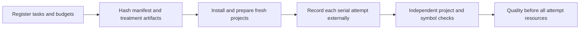

# Registered experiments

Use this harness for new comparisons. Preserve historical batches as separate evidence.
The scripted transport pilot tests recording and grading. It does not measure agent productivity.



## Local transport pilot

Build package exports before registering their hashes.
Keep output directories under private `~/scratch/`.
Use a fresh output directory for each revision.
Follow the [runner preflight protocol](../../docs/benchmark-runbook.md#runner-preflight) before model dispatch.

## Skill loading contract

If a runner embeds a Skill entry, mark it already loaded. Do not request a second entry read.
Supply its complete local reference tree and explicit base inside the allowed project.
Keep instruction bytes unchanged. Record resource hashes and sizes separately in registration metadata.
Resolve relative links from their containing resource. Keep external documentation outside the allowed scope.
Prove every local reference is readable during no-model preflight. Reject missing, escaping, or symlink resources.
Preserve historical registrations. Any loading change requires a fresh registration before model dispatch.
An explicit loading contract does not prove model adherence or resource improvements.

```sh
pnpm build
pnpm exec tsx evals/experiment/cli.ts fixture --installed --nuxt --out ~/scratch/ripide-pilot-registration
pnpm exec tsx evals/experiment/cli.ts run --manifest ~/scratch/ripide-pilot-registration/fixture-manifest.json --out ~/scratch/ripide-pilot-results
```

The fixture includes rename, move, file relocation, import replacement, architecture, and mixed tasks.
An installed dependency fixture runs `pnpm install --offline` and builds its complete TypeScript project.
The Nuxt fixture installs pinned direct dependencies, then runs prepare, typecheck, and build.
Its `.nuxt` state exists before the treatment runs. Final checks regenerate it.
If offline packages are missing, setup becomes `Unavailable`. The attempt stays in totals.
A registered online install can prepare a new pilot revision. Preserve its lockfile in subsequent task snapshots.
Direct dependency pins alone cannot freeze transitive dependencies. Held-out projects must include their lockfiles.

Exact touched-file bytes are part of these scripted tasks.
Their source uses the CLI's single quote convention before registration.
For real tasks, preregister independent accepted outputs or an independently reviewed semantic contract.
Never change an oracle after seeing treatment output.
Unchanged files, comments, unrelated bindings, and non-source assets remain byte checked.
TypeScript references must resolve to the expected declaration. Matching text alone cannot pass.
Nuxt's separate whole-project typecheck grades generated auto-import bindings.

## Transient check pilot

The check pilot compares temporary Vitest modules with `ripide check` through OpenCode.
It captures committed source slices from local Nuxt Link Checker and Unhead checkouts.
It seeds one bug per task and preserves the source commits in private registration evidence.
Run deterministic preflight before authorizing model calls.

```sh
pnpm build
pnpm exec tsx evals/experiment/check-study.ts --out ~/scratch/check-registration
pnpm exec tsx evals/experiment/check-preflight.ts run ~/scratch/check-registration/check-manifest.json ~/scratch/check-preflight
pnpm exec tsx evals/experiment/cli.ts run --manifest ~/scratch/check-registration/check-manifest.json --out ~/scratch/check-results --allow-model-calls
```

Use `--case unhead-real-caller` to register one case. Use `--timeout 360000` to set the preregistered deadline.
Use `--repeats 2` and `--seed 20261010` to repeat a reproducible serial schedule.
Every revision needs fresh registration and result directories. Preserve failures and their recorded usage.
These are pilots. One attempt per method cannot establish token or time savings.
Source slices cannot establish whole-project typecheck, build, or framework compatibility.

Behavior acceptance permits different implementations only in named source files.
A required independent gate preserves signatures and surrounding bytes, then asserts behavior through Node.
The gate requires failing and passing JSON evidence, method adherence, and removal of named test modules.
Generated helper directories remain allowed. The gate does not prove the quality of every agent assertion.
No persistent test source is needed in the evaluated fixture after completion.

## Optimize transient checks

Use `--scope projects` for complete Git copies with original lockfiles, dependencies, and Vitest configurations.
Setup builds and typechecks each project before seeding and committing the bug.
Final gates repeat the project build and typecheck after repair.
Unhead uses a private incremental typecheck cache inside each fresh project.
An independent probe confirmed that changed source errors invalidate that cache.
Nuxt runs its original typecheck command. No cache or dependency tree is shared between project copies.
Existing tests remain unchanged. Newly authored test modules must be removed.
The independent oracle compiles outside the project so its output cannot invalidate execution receipts.

Register both instruction variants before model dispatch. Keep their source commits and runtime artifacts identical.
The baseline gives the commands. The guided variant adds an ordered recipe and a final checklist summary.
Each variant uses the same assertion, preservation, build, typecheck, and cleanup gates.

```sh
pnpm exec tsx evals/experiment/check-study.ts --scope projects --variant baseline --repeats 2 --out ~/scratch/check-baseline-registration
pnpm exec tsx evals/experiment/check-study.ts --scope projects --variant guided --repeats 2 --out ~/scratch/check-guided-registration
pnpm exec tsx evals/experiment/check-preflight.ts run ~/scratch/check-baseline-registration/check-manifest.json ~/scratch/check-project-preflight
pnpm exec tsx evals/experiment/cli.ts run --manifest ~/scratch/check-baseline-registration/check-manifest.json --out ~/scratch/check-baseline-results --allow-model-calls
pnpm exec tsx evals/experiment/cli.ts run --manifest ~/scratch/check-guided-registration/check-manifest.json --out ~/scratch/check-guided-results --allow-model-calls
pnpm exec tsx evals/experiment/check-analyze.ts ~/scratch/check-baseline-results ~/scratch/check-guided-results ~/scratch/check-comparison.json
```

Commands record assertion hashes, source hashes, exits, and output bytes outside the evaluated project.
Red must run against the seeded source. Green must run identical assertions against the submitted repair.
Transient workflows must record repaired-function execution. Integration and API obligations remain pending for assertion review.
Private evaluation evidence may retain assertion text. The evaluated project retains no new test modules.

The comparison refuses changed models, source inputs, oracles, schedules, runtime artifacts, and budgets.
It reports paired changes in uncached input, output, agent time, and prepared workflow time.
Failed executions, assertion revisions, and tool output bytes identify the next optimization.
All failed workflows remain in the paired resource totals. Faster candidates with lower quality receive `Reject`.
Recorded timeouts continue only after tracing proves every child exited. Other infrastructure failures stop the study.

Run the next iteration with fresh registration directories. Change one treatment at a time.
Use another project or task to confirm a change selected from these traces.
Reverse variant order in the next batch to investigate drift. Whole batches still cannot fully control provider drift.
Two repeats support diagnosis. They cannot establish a general efficiency claim or fully counterbalance six mode orders.
Use the held-out protocol below before advertising savings.
For a focused preflight, append a registered case ID after the output directory.

## Register a held-out study

Copy the generated JSON and replace the scripted commands with authorized external commands.
Each command is an argument array. The shell does not interpret it.
Available placeholders are `{project}`, `{promptFile}`, `{mode}`, and `{task}`.
The runner also receives `RIPIDE_EXPERIMENT_PROMPT_FILE` and `RIPIDE_EXPERIMENT_RECORD_DIRECTORY`.
Freeze complete Git commits, launcher files, Skill text, built exports, lockfiles, adapters, and runtime artifacts.
The manifest contains model, reasoning, repair budget, timeout, cache condition, and treatment instructions.
Version commands retain their complete output and exits.

Register `direct`, `forced`, and `hybrid` commands with the same model and reasoning.
Direct uses ordinary tools. Forced uses supported refactors. Hybrid chooses supported refactors when appropriate.
Keep mechanical, architecture, and mixed tasks in separate cohorts.
Use representative whole projects. Do not select tasks using observed treatment gains.
Include dependency installation and preparation commands in `setup`.
Include independent typechecks, full builds, behavior checks, and delivery commands in `checks`.
Mark each command's phase and controller or arm role.

Held-out registration requires repeats divisible by six and child tracing.
The seeded schedule counterbalances every mode in every position.
Execution remains serial. Host load remains observable, rather than assumed absent.
The reviewed pilot analysis hash must match a pinned artifact.
Each held-out task requires independent checks and a required common quality gate.
Model calls require explicit `--allow-model-calls`. This flag is operational authorization, not a claim of measurement validity.

## Quality gates

A quality command exits zero for pass, four for unavailable, and another nonzero code for failure.
Required unavailable gates prevent that attempt from passing.
Raw writer APIs do not imply protected verified-plan commit capability.
The engine capability gate checks an unchanged verified commit, then refuses a changed engine-issued plan without writing source bytes.
This gate measures plan fingerprint protection. It does not prove whole-project freshness.
The exported `checkChangedVerifiedPlan` adapter distinguishes `Committed`, `ValidationRefused`, and `Unavailable`.
Unexpected infrastructure exceptions propagate. They cannot count as successful validation refusal.

Use isolated installed SDK consumers for protected-plan gates.
Register changed verified bytes, appended consumers, cross-engine plans, stale source, and dependency/configuration changes.
An adapter must classify actual validation refusal. A missing server or dependency cannot prove plan protection.
The archived architecture pair only reproduced changed verified-plan bytes.
Appended consumers and dependency/configuration changes remain unavailable until independent adapters prove those contracts.
Stronger safety claims require those separate gates. A passing fingerprint gate cannot replace them.

## Usage and actual charges

The recorder preserves stdout and stderr before parsing.
It timestamps complete JSON output lines in `observed-events.jsonl`.
Provider timestamps take precedence over observation timestamps.
Codex `turn.completed`, native `token_usage_record`, and OpenCode `step_finish` events expose separate token categories.
Native response IDs deduplicate repeated usage records.
Cached input counts once. Reasoning exposed as an output subset counts once.
Missing reasoning detail stays explicitly unavailable. Zero in its numeric field means unobserved.
Missing completion timestamps or invalid cutoffs fail usage parsing.

Actual charges require optional receipt events:

```json
{ "type": "provider_charge", "timestamp": "2026-10-09T01:00:00Z", "receiptId": "provider-receipt-id", "currency": "USD", "amount": 0.25 }
```

Duplicate receipt IDs count once. Conflicting receipts fail parsing.
A provider's zero cost placeholder does not count as an actual receipt.
Without receipts, charges remain unavailable. Token reductions do not establish dollar savings.

External native usage can use registered `usageImports`.
Each import declares path, cutoff, role, phase, task, mode, repeat, and attempt.
Every imported file must have a pinned artifact hash.
Arm imports replace stdout accounting for that attempt. They cannot duplicate observed stdout totals.
Controller imports remain a separate resource category.
Keep response IDs unique across imported phase files. Preserve actual event timestamps.
Never estimate mechanical tokens from elapsed command time.
Mixed responses remain unattributed unless separate phase responses exist.

## Recording boundaries

The immutable manifest records `delivery-completed` as the endpoint.
Complete response usage includes every completed response through the runner's close timestamp.
Separate commit checks record their complete command close, streams, and exit.
Without a registered commit command, commit completion remains unavailable.
Publication counts only when a publication phase command is registered.
Prompts and repair steering are readable private files written before dispatch.
Additional steering can be archived with `steering --out DIRECTORY --text TEXT` before external delivery.
Do not send unrecorded interventions during a held-out task.

The external recorder uses Linux `strace`, GNU `time`, complete streams, and process-group timeouts.
Child fork, exec, wait, and exit records remain available for audit.
All arms receive equivalent tracing overhead.
Recorder CPU, controller commands, arm commands, memory, and sampled host load remain distinct.
Local cache conditions do not prove provider cache state. Provider cache priming remains unavailable.
Warm and cold conditions affect local `XDG_CACHE_HOME`. Uncontrolled uses the existing environment.

Reports retain every setup failure, timeout, refusal, failed attempt, and repair.
Summed resources include failed delivery. Workflow medians include repairs.
Setup and prepared-use resources appear separately.
Successful medians appear alongside all-workflow medians.
Task/workflow bootstrap intervals are descriptive. They do not repair selection bias or provider drift.

## Historical evidence

Run `evals/replay-historical.ts` with a private path map to replay all original raw attempt files.
The map contains batch name, published result path, raw directory, and matched-directory naming flag.
The replay checks saved tokens, seconds, quality, raw summary values, and transcript hashes.
Only sanitized metrics and hashes belong in public results.
Raw native transcripts and prompts stay private.

Read [historical benchmark limits](../../bench/README.md) before using any percentage.
Read the [maintained benchmark runbook](../../docs/benchmark-runbook.md) for rerun decisions.
A held-out repeated study with comparable quality must precede restored-gain advertising.
