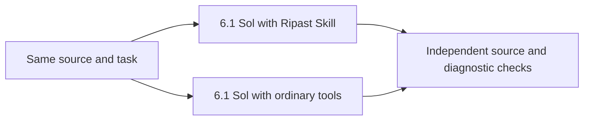

# Ripast evals with gpt-6.1-sol

Ripast passed 10/10. Ordinary editing passed 10/10.
Ripast used 60.4% fewer total tokens across correct pairs.
Ripast used 51.2% less total agent time across correct pairs, a 2.05x aggregate speedup.

## Method

Model: `gpt-6.1-sol`. Reasoning: `medium`. Codex CLI: `0.161.0`.
Ten real project source slices. One attempt per method per project. Three projects ran concurrently.
Each pair used the same task and source. Method order alternated between projects.
Ripast received the current Skill. Ordinary editing used read, edit, and shell tools.
Grading checked expected source, configuration, diagnostic changes, snapshot checks, and method adherence.
The CLI preflight passed all ten cases. Eight eval parser and project tests passed.



## Results

| Project | Ripast | Ordinary editing | Ripast seconds | Editing seconds | Ripast tokens | Editing tokens |
| --- | --- | --- | --- | --- | --- | --- |
| c12 | Pass | Pass | 11.7 | 23.1 | 30,122 | 77,228 |
| unrouting | Pass | Pass | 11.9 | 19.4 | 30,121 | 81,033 |
| harlanzw.com | Pass | Pass | 10.3 | 25.7 | 30,214 | 73,142 |
| nuxt-link-checker | Pass | Pass | 10.0 | 25.5 | 30,150 | 64,653 |
| mdream.dev | Pass | Pass | 9.8 | 24.5 | 30,271 | 68,881 |
| massivemonster.co | Pass | Pass | 10.1 | 22.3 | 30,160 | 75,552 |
| nuxt-seo-utils | Pass | Pass | 11.3 | 19.9 | 30,227 | 70,401 |
| nuxt-site-config | Pass | Pass | 12.3 | 19.3 | 30,193 | 63,265 |
| nuxtseo.com | Pass | Pass | 9.9 | 24.3 | 30,285 | 106,039 |
| unlighthouse.dev | Pass | Pass | 15.4 | 27.2 | 30,267 | 81,698 |

Median project speedup: 2.09x. Median project token reduction: 59.4%.

## Previous Luna batch

The five shared projects used identical source revisions: yes.
Luna passed 9/10 attempts. 6.1 Sol passed 10/10 on those projects.
Luna failed ordinary editing on Unrouting. 6.1 Sol passed that case.
The Skill and harness changed between batches. This comparison cannot isolate the model effect.

## Limits

One attempt per method. Timing includes startup, model work, and the requested snapshot check.
Concurrent work and provider load can change timings. Repeats are needed for stable performance claims.
Tokens include cached input. They do not measure billed cost. Codex events provide no price.
These source slices exclude dependencies and generated Nuxt state. Full builds and browser behavior remain untested.

Measurements: [recorded results](./2026-10-09-6.1-sol.json). Previous batch: [Luna results](./2026-10-09.json).

## Reproduce the model selection

This run used harness revision `3d0dfdc56775bdd952c9037aaeac8c3a0df8fefa`.
Replace `gpt-6-luna` with `gpt-6.1-sol` in `evals/codex-runner.ts` and `evals/projects.ts`.
This sets the executed model and the recorded model. Keep medium reasoning.
Run these commands from that revision, with authenticated Codex and the recorded local source projects:

```sh
pnpm build
pnpm eval:projects --batch second --runner codex --preflight
pnpm eval:projects --batch second --runner codex --timeout 180
```

The recorded source commits and harness hashes identify the measured inputs. Local HEAD changes produce different inputs.
